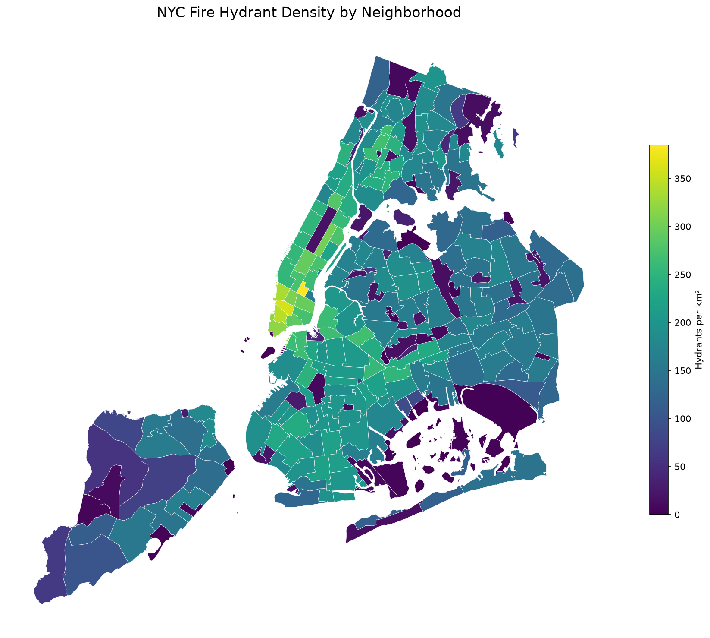

# NYC Hydrant Density Analysis

## The question

Where is hydrant coverage densest in NYC, and which neighborhoods are underserved relative to their area?

## The data

- **NYC Neighborhoods.** 262 polygons (Source: [NYC Open Data](https://opendata.cityofnewyork.us))
- **NYC Fire Hydrants.** 109,725 points (Source: [NYC Open Data](https://opendata.cityofnewyork.us))
- License: NYC Open Data Terms of Use
- All data in EPSG:4326
- Download Date: 2026-09-10

## Methodology

Built the same analysis twice:

- **SQL (PostGIS).** Five progressive queries in `analysis.sql`, going from simple filter to spatial join to area-normalized density to 100m-buffer coverage analysis.
- **Python (GeoPandas).** Equivalent pipeline in `analysis.ipynb`, with a static choropleth and interactive `.explore()` map. Final output exported to GeoParquet.

Both pipelines produce the same density values to within rounding. The Python version produces the visualization. The SQL version runs against a database at scale.

## Findings

- Top 5 neighborhoods by hydrant density (per km²):
  1. [Fill in from your results]
  2. ...
- Bottom 5 neighborhoods (least coverage):
  1. ...
- Median neighborhood has X.X hydrants per km².
- Y% of every neighborhood is within 100m of a hydrant.



## How to run it

Requires Docker (for PostGIS) and Python 3.11+ with GeoPandas.

```bash
git clone https://github.com/{your-username}/nyc-hydrant-analysis.git
cd nyc-hydrant-analysis

# Start the PostGIS template (copy from R2.4 docker-templates/postgis/)
docker compose -f docker/postgis/docker-compose.yml up -d

# Load NYC Open Data into PostGIS (your script of choice)
# Then run the SQL pipeline
psql -h localhost -U gisuser -d nyc -f analysis.sql

# Then the Python pipeline
jupyter lab analysis.ipynb
```

## What I learned

[Two or three sentences. Be specific about which step was harder than expected and what you'd do differently. Do not skip this section.]

## Stack

- PostGIS 16-3.4 (via Docker)
- GeoPandas + SQLAlchemy + matplotlib
- Jupyter Lab
- GeoParquet


-- =============================================================================
-- Notes for your README
--
-- - Query 1 is your sanity check. Don't skip it.
-- - Query 4 is your headline. Identify the top 5 and bottom 5 neighborhoods.
-- - Query 5 is the deeper insight. Look at the median covered_pct. That number
--   is your case-study finding.
-- =============================================================================